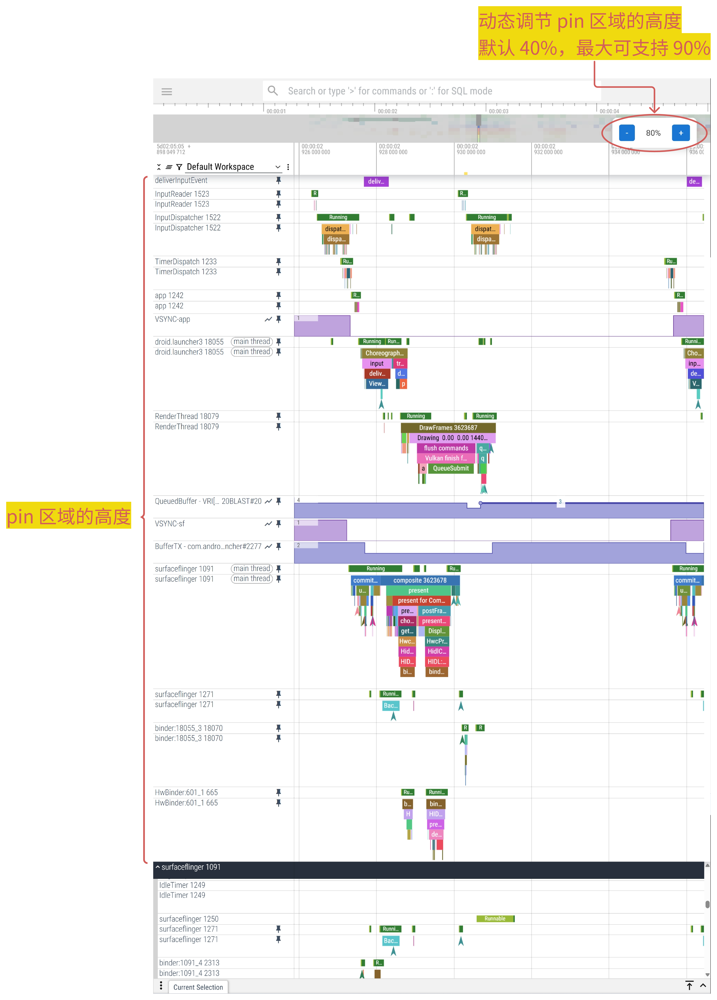

# Perfetto Pinned Track Height Controller



一个用于增强 [Perfetto Trace Viewer](https://ui.perfetto.dev/) 的油猴脚本，提供实时调整 Pinned Track 区域高度的功能。

## 功能特性

- 📏 动态调整 Pinned Track 区域高度（10% - 90%）
- ➕/➖ 通过按钮以 5% 步长增减高度
- 🔄 实时显示当前高度百分比
- 🎨 精心设计的 UI 控件，完美融入原页面风格
- ⚡ 自动适配页面动态加载内容
- ⚙️ 支持自定义配置参数

## 安装指南

### 前置要求
- 用户脚本管理器扩展（[Tampermonkey](https://www.tampermonkey.net/) 或 [Violentmonkey](https://violentmonkey.github.io/)）

### 安装方式
1. 直接安装：
   - 点击此链接安装脚本：  
     [](https://greasyfork.org/zh-CN/scripts/531117-perfetto-pin-%E5%8C%BA%E5%9F%9F%E9%AB%98%E5%BA%A6%E8%B0%83%E6%95%B4)

2. 手动安装：
   - 复制 [脚本代码](./perfetto.js)
   - 在油猴脚本管理器中新建脚本并粘贴

## 使用说明

1. 访问 [Perfetto Trace Viewer](https://ui.perfetto.dev/)
2. 页面加载完成后，右上角会出现控制面板：
   - "+" 按钮：增大高度比例
   - "-" 按钮：减小高度比例
   - 中间数字显示当前百分比
3. 高度调整即时生效，支持动态内容更新

## 自定义配置

通过修改脚本中的常量值实现：

```javascript
// 基础配置
const MIN_HEIGHT = 10;    // 最小高度百分比
const MAX_HEIGHT = 90;    // 最大高度百分比
const STEP = 5;           // 调整步长

// 样式配置
const POSITION = {        // 控制面板位置
  top: '70px',            // 距顶部距离
  right: '25px'           // 距右侧距离
};
```

## 兼容性

- 浏览器：Chrome / Firefox / Edge 最新版
- 平台：Windows/macOS/Linux
- Perfetto 版本：v23.0+

## 贡献指南

欢迎通过以下方式参与贡献：

1. 提交 Issue 报告问题或建议
2. Fork 仓库并提交 Pull Request
3. 改进代码或文档
4. 分享使用体验

## 许可证

[MIT License](LICENSE) © 2024 [Your Name]